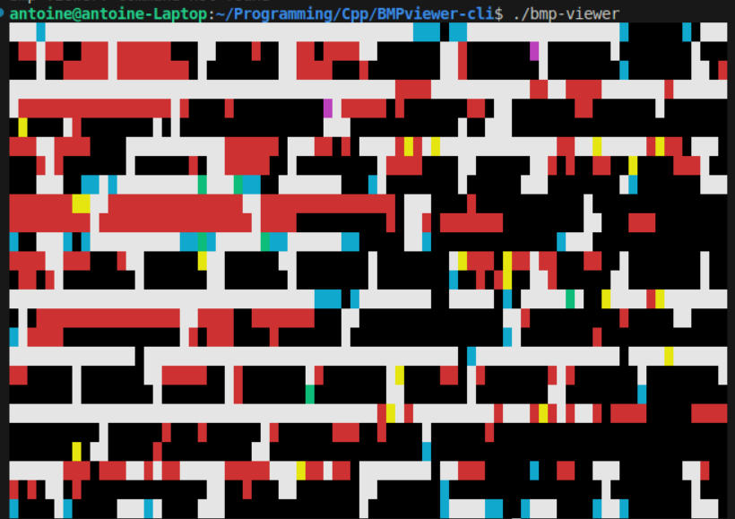

A small BMP image CLI viewer in the command line with no dependencies.
This viewer parses the BMP file using the standard specifications.

Compilation
```bash
g++ main.cpp color.cpp bmpReader.cpp -o bmp-viewer
```

Usage :
```bash
Usage : bmp-viewer
        bmp-viewer <input>
        bmp-viewer <input> --scale <scale-factor>
```

Examples:




